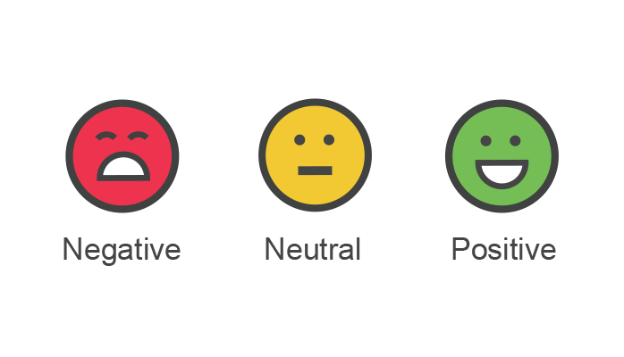

# SentAnaly - Sentiment Analysis
## This project is in progress. 
This project is my development for the Sentiment Analysis problem. This project composes of multiple stage:

1. First stage composes of experiments on various techniques from simple method such as purely DNN, Conv1D, different word embeddings to complicated one such as Transformer. The goal is to push the performance as high as possible.
2. Second stage is applying all of these experiments for the real dataset.

The dataset for the first stage of this project is IMDb for the first stage. A dataset of Kaggle such as the dataset for hate speech detection competition will be used.

## TODO List
- [x] Setting up the baseline  
- [x] Trying with different pretrained word embeddings
- [ ] Adding Transformer
- [ ] Applying for hate speech dataset
- [ ] Fintuning and improving the model. 
